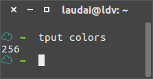
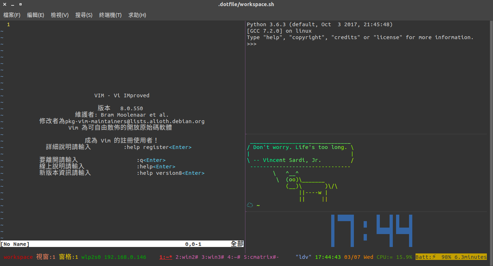
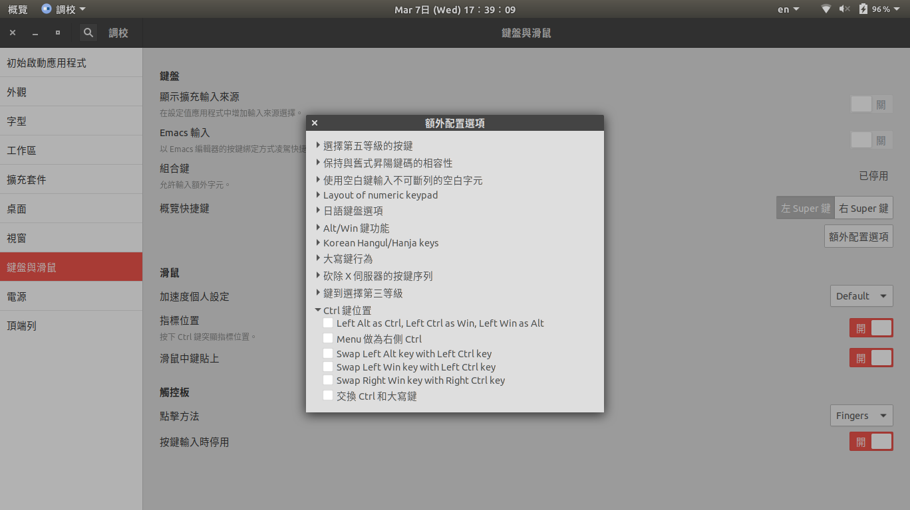

# LauDai dotfile config

**_Author : LauDai_**

**Contents**

- <a href=#tag-tmux>How to use tmux</a>
  - <a href=#tag-tmux-Colors>Colors</a>
  - <a href=#tag-tmux-keybindings>My tmux keybindings</a>
  - <a href=#tag-tmux-screenshot>tmux screenshot</a>
- <a href=#tag-zsh>Zsh</a>

# <a id="tag-tmux" href="#tag-tmux">How to use tmux</a>

_My tmux configure is running in tmux 3.0a version_

## <a id="tag-tmux-Colors" href=#tag-tmux-Colors>Colors</a>

In tmux Manual

```text
The colour is one of: black, red, green, yellow, blue, magenta, cyan, white, aixterm bright variants (if supported: brightred, brightgreen, and so on), colour0 to colour255 from the 256-colour set, default, or a hexadecimal RGB string such as ‘#ffffff’, which chooses the closest match from the default 256-colour set.
```

### Check your terminal color support colors

There are two file can test your terminal color.

`$bash color_test1.sh`
or
`$bash color_test2.sh`

#### You can type in ternimal to show your ternimal supoort colors

`$tput colors`



Set tmux 256 colors
`set -g default-terminal "screen-256color"`

Show your tmux setting
`$tmux show -g`

Show tmux bind kyes
`<prefix> ?`
or
`:list-keys`

## <a id="tag-tmux-keybindings" href=#tag-tmux-keybindings>My tmux keybindings</a>

---

My prefix setting is C-a

```text
<prefix> | : split window horizontal 	(origin path)
<prefix> _ : split window vertical 		(origin path)
<prefix> \ : split window horizontal 	(current path)
<prefix> - : split window vertical 		(current path)
<prefix> C : creat a new windw from current path to  next index
<prefix> C-b : clear screen & screen history
<prefix> = : choose buffer (no zoom to window)
<prefix> M-k : confirm before kill current session
<prefix> C-k : confirm before kill current window
<prefix> C-o : rotate the current window upward 	(repeat)
<prefix> M-o : rotate the current window downward 	(repeat)
M-| : set layout main vertical
M-_ : set layout main horizontal
C-| : set layout even horizontal
C-_ : set layout even vertical
C-t : set layout tiled
<prefix> C-t : via a choose window to move current pane to window
<prefix> C-j : prompt a cmd to join <window>.<pane> to this pane
<prefix> o : select next pane (repeat)
<prefix> / : select last window
<prefix> M-s : prompt a cmd to swap current window's index to target index
<prefix> M-f : set repeat 0.6s , titles off , display time 0.75s
<prefix> M-n : set repeat 1s , titles on , display time 1.5s
<prefix> M-v : swap current pane to last vistied pane
<prefix> T : move window to next unused number
<prefix> S : prompt a cmd to new session
<prefix> @ : prompt a cmd to change window's index
M-1~9 : select current windows's pane
M-s : synchronize all panes
C-S-Up :add 50 lines to up
C-S-Down :add 50 lines to down
C-S-Left : add 50 lines to left
C-S-Right : add 50 lines to right
```

If you wanna see more origin useful tmux keybindings. U can checkout my [gist](https://gist.github.com/laudai/1d084f664e987e50fdceebcdd699261d).

M - which is the Meta key (i.e. Alt on most keyboards)

S - means Shift key

※ Note: Can't send C-| to putty, windows terminal and MobaXterm. Maybe this is a bug!?

※ Note: Can't send \<prefix> C-h in MobaXterm. Maybe this is a bug in MobaXterm!?

### In copy-mode

> Copy-mode use vi-mode, use tmux-yank plugin.

in copy-mode-vi will binding `Space` key to send begin-selection

`bind-key -T copy-mode-vi Space send-keys -X begin-selection`

## <a id="tag-tmux-screenshot" href=#tag-tmux-screenshot>tmux screenshot</a>



You can find more example tmux.conf from
`/usr/share/doc/tmux/examples`

## Requirements

#### For workspace.sh

all you can get via `sudo apt install`

- `ipython3`, `htop`, `speedtest-cli`, `glances`, `mc`, `screenfetch`
- `fortunes`, `lolcat`, `cowsay`, `cmatrix`

#### For tmux plugin

- `xsel` (recommended) or `xclip` for tmux-yank
- `urlview` for tmux-urlview
- `iostat` or `sar` (Optional requirement) for tmux-cpu

You can open a highlighted text in copy-mode via press `o` or `Ctrl-o` to open file by `xdg-open` or `$EDITOR` respectively .Power by tmux-open pulgin

# <a id="tag-zsh" href=#tag-zsh>Zsh</a>

## My zsh plugins

`git pip python systemd tmux docker docker-compose encode64 autojump history-substring-search zsh-autosuggestions zsh-syntax-highlighting sudo vscode vi-mode zsh-navigation-tools git-open`

##### tmux_note.txt is a file that remind some tmux setting

##### zshrc.zsh-template.orig is the oh-my-zsh template original file backup.

---

[you can change your Ctrl to CAPS via this link](http://www.atjiang.com/pragmatic-tmux-configure/)

```text
绑定 CAPS LOCK 键到 CTRL 键

在 OS X 上：打开 Keyboard preference panel->System Preference，按下 Modifier 键，然后将 CAPS LOCK 的动作改为 Control。

在 Linux，需对键盘配置文件进行修改：

sudo vi /etc/default/keyboard

找到以 XKBOPTIONS 开头的行，添加 ctrl:nocaps 使 CAPS LOCK 成为另一个 CTRL 键，或者添加 ctrl:swapcaps 使 CAPS LOCK 键和 CTRL 两键的功能相互交换。 例如，修改后的内容可能为：

XKBOPTIONS="lv3:ralt_alt,compose:menu,ctrl:nocaps"

然后运行：

sudo dpkg-reconfigure keyboard-configuration
```

---

## [Emacs Wiki : MovingTheCtrlKey](https://www.emacswiki.org/emacs/MovingTheCtrlKey)

---

### Ubuuntu 17.10 can use gnome-tweak-tool to change the CTRL to CAPS LOCK key


