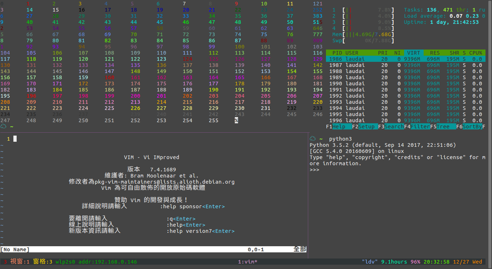

# LauDai dotfile config
**Tmux configure is running in tmux 2.1 version**

---

#### There are two file u can test your terminal color
#### you could use like this code:

`$bash color_test1.sh`

* color_test1.sh
* color_test2.sh

### you could type in ternimal to show your ternimal supoort colors
`$tput colors`

Screenshot for tmux


You can find more example tmux.conf from /usr/share/doc/tmux/examples

Show your tmux setting
`$tmux show -g`

Show tmux bind kyes
`<prefix> ?`
`:list-keys`

**This is my addition config** 
```
<prefix> C : creat a new windw from current path to  next index
<prefix> C-s : synchronize all panes
M-k : confirm before kill window
C-k : confirm before kill session
C-o : rotate the current window
M-| : set layout main vertical
M-_ : set layout main horizontal
C-| : set layout even horizontal
C-_ : set layout even vertical
C-t : set layout tiled
<prefix> C-t : via a choose window to move current pane to window
<prefix> C-j : prompt a cmd to join <window>.<pane> to this pane
<prefix> M-n : set repeat 0.6s , titles off , display time 0.75s
<prefix> M-s : set repeat 1s , titles on , display time 1.5s  
<prefix> S : prompt a cmd to new session
<prefix> T : move window to next unused number
<prefix> M-1~9 : select current windows's pane
```
**In copy-mode**
```
v : begin selection
V : select whole line
C-v : rectangle selection
y : copy selection
```
`In config u need C-\ to use C-| , maybe is a bug in tmux 2.1 version`
##### tmux_note.txt is my note to remind me what i config
##### zshrc.zsh-template.org is the oh-my-zsh template origin file backup.

---

[you can change your Ctrl to CAPS via this link](http://www.atjiang.com/pragmatic-tmux-configure/)
```
绑定 CAPS LOCK 键到 CTRL 键

在 OS X 上：打开 Keyboard preference panel->System Preference，按下 Modifier 键，然后将 CAPS LOCK 的动作改为 Control。

在 Linux，需对键盘配置文件进行修改：

sudo vi /etc/default/keyboard

找到以 XKBOPTIONS 开头的行，添加 ctrl:nocaps 使 CAPS LOCK 成为另一个 CTRL 键，或者添加 ctrl:swapcaps 使 CAPS LOCK 键和 CTRL 两键的功能相互交换。 例如，修改后的内容可能为：

XKBOPTIONS="lv3:ralt_alt,compose:menu,ctrl:nocaps"

然后运行：

sudo dpkg-reconfigure keyboard-configuration
```
